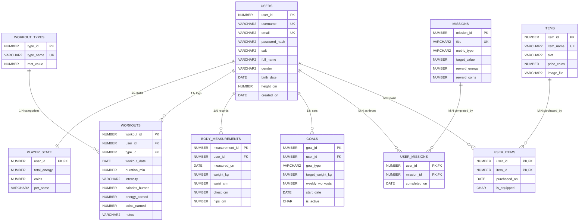

# FitSo Entity-Relationship Diagram

## Mermaid ER Diagram

## Cardinality & Relationship Summary
1. `USERS` (1) to `PLAYER_STATE` (1): Mandatory 1:1 relationship created at user registration.
2. `USERS` (1) to `WORKOUTS` (N): One user can log many workouts.
3. `WORKOUT_TYPES` (1) to `WORKOUTS` (N): One workout type categorizes many workout instances.
4. `USERS` (1) to `BODY_MEASUREMENTS` (N): One user records progress measurements over time.
5. `USERS` (1) to `GOALS` (N): One user sets zero or active/historical goals.
6. `USERS` (M) to `MISSIONS` (N) via `USER_MISSIONS`: Many-to-Many resolution table storing completion date.
7. `USERS` (M) to `ITEMS` (N) via `USER_ITEMS`: Many-to-Many resolution table storing purchase date and active equipped status.
